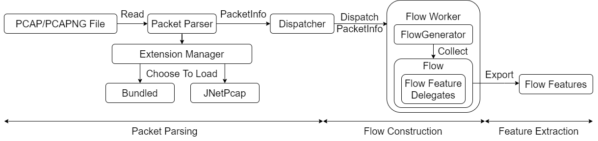
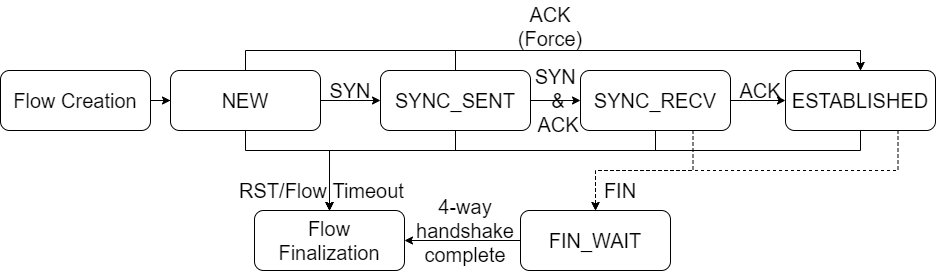

# JFlowInspector
JFlowInspector is a tool to inspect network traffic, identify network flows and extract preset
features to CSV file.

## History
Inspired by [CICFlowMeter](https://github.com/ahlashkari/CICFlowMeter), the project originally
is forked to [CICFlowMeter Mk.6](https://github.com/Tomahawkd/CICFlowMeter-Mk.6). After a massive
code refactor, CICFlowMeter Mk.6 is able to extract more features, not only the TCP features
but also HTTP features.

To read HTTP data from TCP stream, CICFlowMeter Mk.6 is refactored again to add the ability to 
reassemble the HTTP data from several TCP segments. However, the TCP reorder and reassembly slows
down the whole inspecting procedure significantly.

The third code refactor comes with multi-threading and a faster pcap file parser. This is the 
current CICFlowMeter Mk.6. For now, it is way different from the original CICFlowMeter, and 
I'm tend to provide more features for CICFlowMeter Mk.6. Therefore, the original CICFlowMeter Mk.6
project is migrate to a new repository, which here is the place for the new generation of the 
CICFlowMeter and CICFlowMeter Mk.6.

## Prerequisite
Java 8

(Optional) jnetpcap native library and use `-Djava.library.path` to link native library with jar (you can find
   it in `./lib/jnetpcap` or download it from [original project](https://sourceforge.net/projects/jnetpcap/)).

From v0.7.5, the Jnetpcap Packet parser is moved to the plugin, so you could ignore 
the optional jnetpcap library, **unless** you are using it via commandline `--old`
and `--old_path` which requests JFlowInspector to use Jnetpcap Packet parser.

From v0.8.0, after we import the extension manager from [TLS-Tester](https://github.com/Tomahawkd/TLS-Tester),
`--old` and `--old_path` has been removed, instead, you could use `--extension` to tell the extension
directory and `-p` or `--parser` to tell which parser to use (`bundled` for default, `jnetpcap` for Jnetpcap Packet
parser).

## Build
Clone the code and its submodule and use maven to create jar.

```shell
# initialize submodule
git submodule init
git submodule update

# compile via maven, find jar in ./bin
mvn package
```

## Developing Note
Since this project is still at early development, and it is still under my 
graduate project, internal structure, behaviour may vary and limit 
in different version.

## Flow Analysis Warning
For TCP flows, the JFlowInspector allocate a Flow Object for analysis.
The flow would be terminated by FIN, RST and `--flow_time` which stands
for flow timeout. Therefore, if the network traffic contains too many
flows at the same time, you need to allocate sufficient memory to 
JFlowInspector via `-Xmx` to accept the flow, otherwise you will 
receive `OutOfMemoryException` by JVM.

A classical example to this is DoS/DDoS. The JFlowInspector initializes
resources to these flows, so actually the network traffic is attacking
JFlowInspector.

### Commandline Option Solutions
To reduce the size of memory JFlowInspector is using, there are several
commandline options:

**Mode**

**Commandline**: `-m <mode>` or `--mode <mode>`  
**Description**:   
Currently JFlowInspector has two modes to analyse flows,
`FULL` and `SAMPLING`.   
Mode `FULL` interprets **Flow timeout** as the 
maximum interval of two packets in a flow, if the flow receives no 
packets in **Flow timeout**, the flow is terminated. The flow has **no
maximum interval** which is different from Mode `SAMPLING`.  
Mode `SAMPLING` interprets **Flow timeout** as the maximum interval 
of a flow. It limits the maximum time a flow exists. This mode would
consume **less** memory.  
Mode `DEFAULT` and mode `ONLINE` will use mode `FULL` to analyse the 
flow.


**Flow timeout**

**Commandline**: `-f <timeout>` or `--flow_time <timeout>`  
**Description**:   
The `timeout` defines the maximum interval of two packets in a flow (
Mode `ONLINE`) or the maximum interval of flow (Mode `SAMPLING`).

**Flow threads**

**Commandline**: `-t <threads num>` or `-flow_thread <threads num>`  
**Description**:   
The flow threads is holding `FlowGenerator` which manages flow creation
and flow termination and stores Flow Objects. More threads could 
accelerate the flow analysis but stores more Flow Objects in memory.
Lower threads may slow down the analysis but **consumes less memory**.  
**Note**: Though more threads could accelerate the flow analysis, 
it is still limited by the rate of the packet parsing which is running
on a single (main) thread.

**Flow queue**

**Commandline**: `-q <queue size>` or `--flow_queue <queue size>`  
**Description**:  
The flow queue is a buffer to store unconsumed parsed packet.
Typically, it is used to balance the rate of the packet parsing and 
the rate of the flow analysis. It would block the packet parsing 
if the queue is full. The queue is stored in thread workers, so 
the overall queue length is `Queue_Size * Thread_Count`.

## About JnetPcap Parser Plugin

The native library of Jnetpcap is acquired from the original 
[CICFlowMeter](https://github.com/ahlashkari/CICFlowMeter) repo.
For more information about jnetpcap, please follow the [link](https://sourceforge.net/projects/jnetpcap/).

The plugin Jnetpcap and associated native library is only tested on Windows platform.

## JFlowInspector Workflow

### Overview


### Flow Status


## Commandline Help
```
Usage: <main class> [options] Pcap file or directory.
  Options:
    -a, --act_time
      Setting timeout interval for an activity.
      Default: 5000000
    -c, --continue
      Indicate the files in input dir are continuous.
      Default: false
    --debug
      Show debug output (sets logLevel to DEBUG)
      Default: false
    --extension
      manually set extensions' directory
      Default: extension
    -q, --flow_queue
      Set the queue length waiting for flow process
      Default: 256
    -t, --flow_thread
      Set the thread count to process flows
      Default: 5
    -f, --flow_time
      Setting timeout interval for a flow.
      Default: 120000000
    -h, --help
      Prints usage for all the existing commands.
    -m, --mode
      Mode selection.
      Default: DEFAULT
      Possible Values: [DEFAULT, SAMPLING, FULL, ONLINE, DIAGNOSIS]
    -n, --no
      Ignores specific feature (use as -no <feature1>,<feature2>)
      Default: []
    --noassemble
      Disable TCP Reassembing
      Default: false
    -1, --one_file
      Output only one file.
      Default: false
    -p, --parser
      Declare the packet parser to parse pcap/pcapng files
      Default: bundled
    --quiet
      No output (sets logLevel to NONE)
      Default: false
    --safe
      Ignore all extensions.
      Default: false
  * -o, -output
      Output directory.
```
